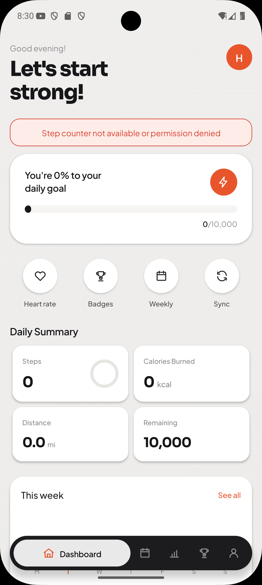

# Step Flow

A fitness step-tracking mobile app built with **React Native (Expo)**, featuring Google Sign-In, a Java backend for secure token verification, and a device-licensing system.

<!-- Add screenshots or a demo GIF here. Example:

-->

## Features

- **Daily step tracking** with persistent history stored on the device
- **Weekly, monthly and yearly stats** calculated from your step history (fixed calendar-week logic)
- **Google Sign-In** using Firebase Authentication
- **Secure backend verification**: the Java backend verifies Firebase ID tokens using the Firebase Admin SDK
- **Device licensing**: UUID-based file binding with cryptographic signing to tie a license to a device
- **Light and dark themes** with a shared theme context

## Tech Stack

| Layer | Technology |
|---|---|
| Mobile app | React Native, Expo |
| Authentication | Firebase Authentication (Google Sign-In) |
| Backend | Java, Firebase Admin SDK |
| Local storage | AsyncStorage |
| State management | React Context (`StepContext`, `ThemeContext`, `AuthContext`) |

## Architecture Highlights

- **Context-based state:** separate `StepContext`, `ThemeContext` and `AuthContext` keep step data, theming and auth state independent.
- **Persistent step storage:** steps are saved in AsyncStorage as a `{ "YYYY-MM-DD": steps }` map, and weekly, monthly and yearly totals are derived from it.
- **Performance:** `useMemo` for derived stats, plus `useCallback`, `React.memo` and `useContext` to avoid unnecessary re-renders.
- **Auth flow:** the app signs in with Google through Firebase and sends the ID token to the Java backend, which verifies it before trusting the user.
- **Licensing:** a UUID is bound to the device through a signed file, so the license can be verified locally and tampering is detectable.

## Project Structure

```
StepFlowApp/
├── App.js
├── app.json
├── babel.config.js
├── package.json
├── assets/        # icons, splash screens, SVG icons
├── plugins/       # Expo config plugins
├── scripts/       # helper scripts
└── src/           # screens, contexts, components
```

## Getting Started

### Prerequisites

- Node.js (LTS)
- Expo CLI (`npx expo`)
- A Firebase project with Google Sign-In enabled
- Java (JDK) if you want to run the backend

### Run the app

```bash
# 1. Clone the repository
git clone https://github.com/Harshu8155/step-flow.git
cd step-flow

# 2. Install dependencies
npm install

# 3. Add your Firebase configuration (see below)

# 4. Start the app
npx expo start
```

### Firebase setup

This repo does **not** include any secrets or config files. To run the app yourself:

1. Create a Firebase project and enable **Google** as a sign-in provider.
2. Add your own Firebase config (for example `google-services.json` for Android) as described in the Firebase and Expo docs. This file is git-ignored.
3. For the backend, create a service account in Firebase and keep its JSON key **out of version control**.

## Roadmap

- [ ] Move sensitive API logic fully to the backend
- [ ] Add more charts and progress insights
- [ ] Add unit tests for stats calculations

## Author

**Harsh**
GitHub: [@Harshu8155](https://github.com/Harshu8155)

Feedback and suggestions are welcome. Feel free to open an issue.
